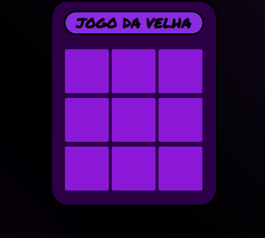
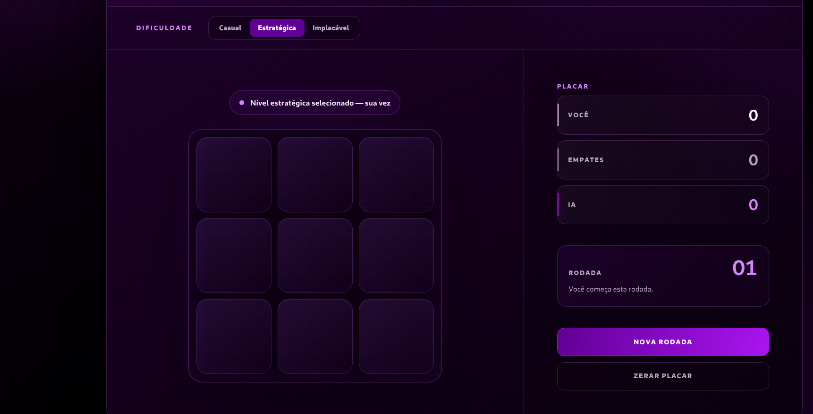

# Tic-Tac-Toe V2

An evolution of the first web game I built in 2022. This version preserves the original purple-and-black identity while rebuilding the interface, artificial intelligence, responsiveness, accessibility, and performance for a modern portfolio project.

## Visual evolution

### Original version — 2022



The first version established the visual identity of the project: a compact purple board, a dark background, and simple player-versus-computer gameplay. It was an important starting point for practicing HTML, CSS, and JavaScript.

### Current version — V2



V2 expands that original idea into a complete game experience. The same color palette now supports a responsive interface with selectable difficulty, a persistent scoreboard, round tracking, clearer feedback, and a much stronger opponent.

## From V1 to V2

| Area | 2022 version | Current V2 |
| --- | --- | --- |
| Interface | Small fixed game card | Responsive game dashboard for mobile, tablet, and desktop |
| Visual design | Basic purple grid | Refined hierarchy, lighting, depth, status feedback, and score cards |
| Artificial intelligence | Random available move | Three difficulty levels with strategic decisions and Minimax |
| Challenge | Easy to predict and defeat | Blocks threats, creates winning plays, and offers an unbeatable mode |
| Match flow | Page reload after a result | Automatic next round after a short result pause |
| Score | No persistent match history | Player, draw, and AI scores saved in the browser |
| Starting player | Player always started | Starting player alternates between rounds |
| Responsiveness | Limited breakpoints | Layout adapted down to small mobile screens |
| Accessibility | Basic mouse interaction | Mouse, touch, keyboard navigation, labels, and live status messages |
| Performance | Infinite full-page gradient animation and reloads | Static layered backgrounds, one-shot timers, and no continuous render loop |
| Dependencies | External Google Font request | No frameworks, libraries, external fonts, or runtime dependencies |

## Features

- Three AI levels: Casual, Strategic, and Unbeatable
- Minimax-based opponent for optimal play
- Automatic transition after every win, loss, or draw
- Alternating first player between rounds
- Persistent local scoreboard
- Winning-line highlight and live match status
- Responsive layout for phones, tablets, notebooks, and large screens
- Mouse, touch, and keyboard support
- No installation or build process
- GitHub Pages compatible

## Difficulty modes

| Mode | Behavior |
| --- | --- |
| Casual | Occasionally leaves an opening and is suitable for relaxed matches |
| Strategic | Blocks immediate threats and selects the optimal move most of the time |
| Unbeatable | Uses Minimax on every turn and cannot be defeated with perfect play |

## Performance decisions

The original animated full-screen gradient was replaced with static layered gradients. V2 does not use Canvas, `requestAnimationFrame`, `setInterval`, or a permanent JavaScript rendering loop. The AI runs only after a valid move, and the automatic round transition uses a single short timeout.

The interface also avoids external font downloads, heavy visual libraries, and full-page reloads. When the player is not interacting with the game, there is no continuous game processing.

## How to play

1. Select a difficulty level.
2. Choose an empty cell to place **X**.
3. The AI responds with **O**.
4. Complete a horizontal, vertical, or diagonal line before the AI.
5. After the result is displayed, the next round starts automatically.

## Run locally

No installation is required. Open `index.html` directly in a modern browser or serve the project with a simple static server:

```bash
python3 -m http.server 8000
```

Then open `http://localhost:8000`.

## Project structure

```text
Jogo-Da-Velha/
├── estilos.css
├── scripts.js
├── jogo-da-velha-2022.png
├── jogo-da-velha-v2.png
├── index.html
└── README.md
```

## Technologies

- HTML5
- CSS3
- Vanilla JavaScript
- Local Storage API
